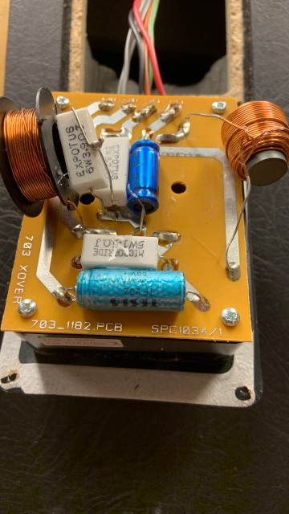

# Cross-over filter

## Markings on PCB

* 703 XOVER
* 703_1182.PCB
* SPC1034/1

## Components on PCB

### Spools

* 
* 

### Resistors

| Brand         | W     | Ω     | Rating    |
| ---           | ---   | ---   | ---       |
| Micropride    | 5W    | 1.5 Ω | J         |
| Expotus       | 6W    | 3.9 Ω | J         |
| Expotus       | 5W    | 8.2 Ω | J         |

### Capacitors

| Brand / Type  | Type      | Farad | Voltage   | Description   |
| ---           | ---       | ---   | ---       | ---           |
| TESLA         | TF 202    | 4μ7   | 50V       |               |
| ALCAP         | 93-9530   | 20MFD | 50v       |               |